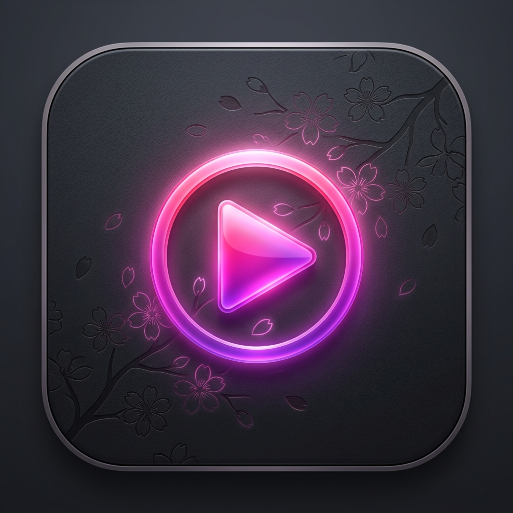
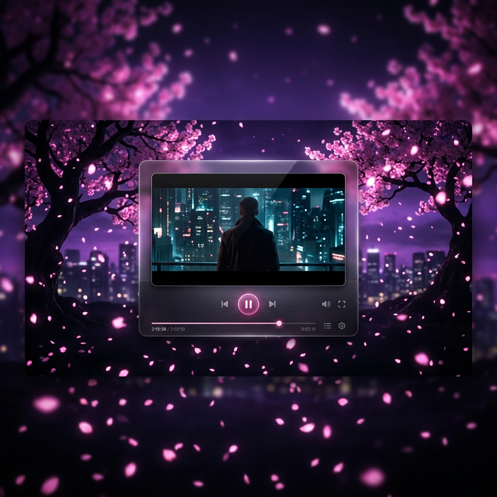

<p align="center">
  
</p>

# <p align="center">Lumina Media Player</p>
### <p align="center">Cinematic • Premium • Dark Sakura Edition</p>

---



Lumina is a feature-rich Flutter media player designed for immersive local and remote media experiences. It combines a polished **Dark Sakura** UI with powerful library management, browser downloads, IPTV, and smart media discovery.

## ✨ Key Features

- **🌸 Dark Sakura UI**: Glassmorphism, premium gradients, and subtle particle effects.
- **🎥 Cinematic Experience**: Intro sequences and ambient menu music for a polished media app feel.
- **🌐 Local Media Server**: Stream your library across devices on the same network.
- **☁️ Remote Access**: Cloudflare Tunnel integration for secure access without port forwarding.
- **📺 Multi-Platform**: Supports desktop, mobile, Apple TV, and Samsung TV (Tizen).
- **📁 Downloads Manager**: Built-in browser download tracking, retry/cancel support, and direct folder access.
- **🎵 Music Search & Metadata**: Spotify and MusicBrainz integration for better artist and track discovery.
- **🤖 Subtitle Tools**: AI-powered transcription and translation using local Whisper models.
- **🛠 Debug & Monitoring**: Settings panels expose logs for server, tunnel, and playback diagnostics.

## 🛠 Technology Stack

- **Framework**: [Flutter](https://flutter.dev)
- **State Management**: Provider
- **Persistence**: SQLite, JSON, and local file storage
- **Remote Access**: Cloudflare Tunnel (`cloudflared`)
- **Platform Support**: macOS, iOS, Apple TV, Tizen, Windows

## 🚀 Getting Started

### Prerequisites

- Flutter SDK (latest stable)
- `cloudflared` installed for remote access
- Platform-specific tooling for your target device

### Installation

1. **Clone the repository:**
   ```bash
   git clone https://github.com/nahalewski/Lumina.git
   cd Lumina
   ```

2. **Install dependencies:**
   ```bash
   flutter pub get
   ```

3. **Run the app:**
   ```bash
   flutter run
   ```

## 📐 Project Structure

- `lib/providers/`: Core state management and background services.
- `lib/services/`: Download manager, metadata providers, media server, and platform bridges.
- `lib/screens/`: UI screens for library, player, browser, downloads, settings, and IPTV.
- `lib/widgets/`: Shared UI components and navigation.
- `macos/`, `ios/`, `tizen/`, `windows/`: Platform-specific build targets.

## 📦 Notes

- `.env` is used for secret configuration and should not be committed.
- The app includes a browser-based downloads panel and a dedicated Downloads tab in the sidebar.

## 📜 License

© 2024 Ben Nahalewski. All rights reserved.

---

<p align="center">
  Developed with ❤️ for the cinematic enthusiast.
</p>
